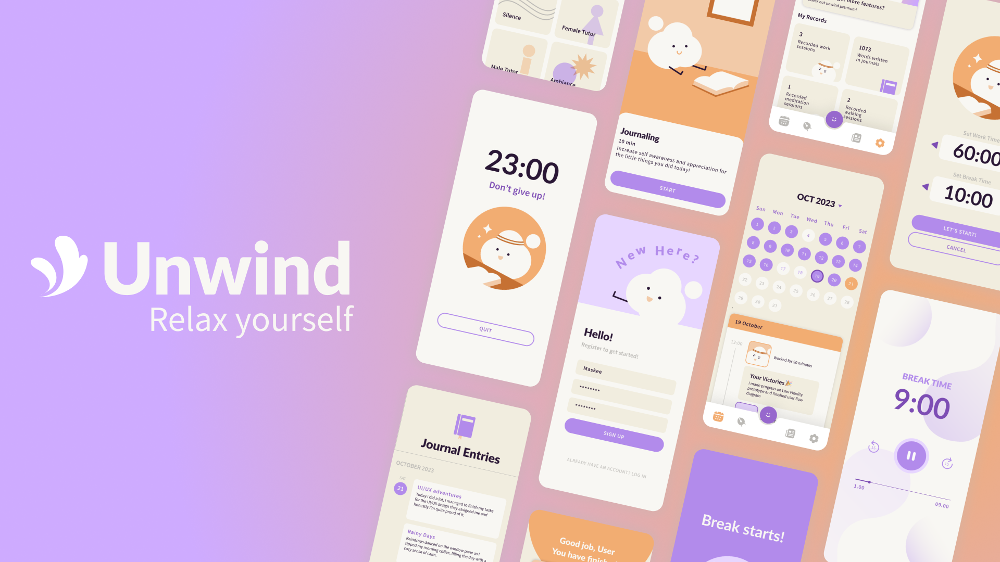

    <picture>
      <source media="(prefers-color-scheme: dark)"
          srcset="./assets/unwindLogo-Light.svg"
          width="600"
          height="200"
      />
      <source media="(prefers-color-scheme: light)"
          srcset="./assets/unwindLogo-Dark.svg"
          width="600"
          height="200"
      />
      
    </picture>

  Your Go-To Productivity and Mental Wellness App

  

  
  </a>

      </td>

# Unwind
A mobile application for journaling and productivity.

## Table of Contents
- [What is Unwind](#whatisunwind)
- [How do I use it?](#howtouse)
- [Contributors](#contributors)
## What is Unwind?

The world is moving at an increasingly fast pace - it is easy for people, especially youth, to feel overwhelmed.

An imbalanced lifestyle, poor attention towards mental wellness, and the rising demand for young people. It’s easy to fall into a vicious cycle of fatigue.
Unwind provides a **safe online platform for users to unwind** after a long day at school or work, through features like mood tracking, courses, journaling and meditation.

## How do I use it?

As of right now, we have not published the application to any major application store. However, you can build your own version by using Expo. There are some prequisites however, you must have [NodeJS](https://nodejs.org/en) installed beforehand. If you already have it, here's how you can build your own Unwind application.

Clone this repository by using this command:

    % git clone https://github.com/rayhanmp/unwind-app.git

Go to the repository location:

    % cd unwind-app

Install all the required packages:

    % npm install

Make sure you already have an Expo account, then build the project using EAS:

    % eas build --profile development --platform android

After the build is done, the CLI will ask you to install the application in your Android emulator. Alternatively, you can also download the .apk through their site. If you choose to run it using Android emulator, then boot up the emulated device, then run:

    % npm expo

Press `a` to open it in the emulator. Done.

## Tech Stack
- React Native
- Expo
- Firebase
- React Native Paper

## Contributors

|  |  | 
| :---: | :---: | :---: |
| [Aulia Nadhirah Y. B.](https://github.com/Aulianyb) | [Kinanti W. Asih](https://github.com/KinantiWening1) | [Rayhan M. Pramanda](https://github.com/rayhanmp) |

## License
This project is licensed under the GNU General Public License version 3 (GPLv3).
